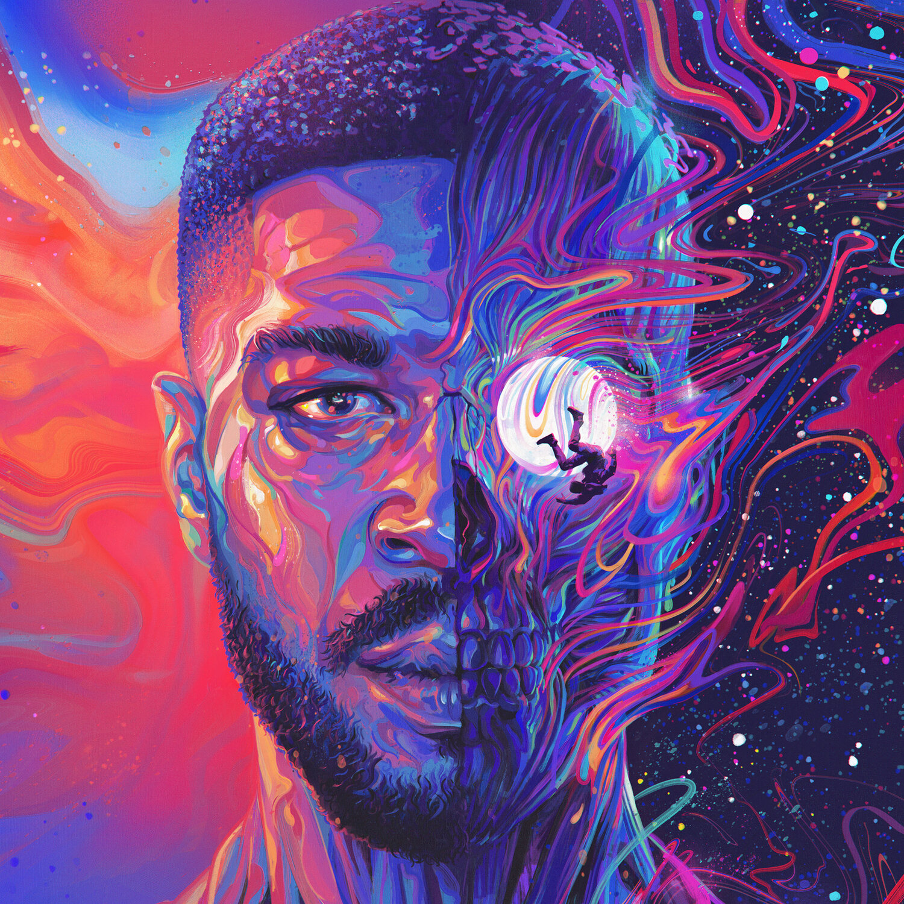
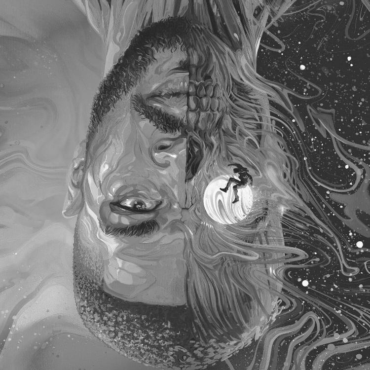

# Image processing

This project is intended to offer a set of basic features on image processing. At this moment, it just take all the images on the images folder and perform the effects needed

## Features 🌟

- [X] Flip X
- [X] Flip Y
- [-] Rotate 
  - [ ] 90 degrees
  - [ ] 180 degrees
  - [X] 270 degrees (kind of...)
- [X] Grayscale
- [-] Resize
  - [X] Nearest neighbor (low quality)
  - [ ] Bilinear interpolation
  - [ ] Bicubic interpolation
- [ ] Blur
- [ ] Sharpen
- [ ] Other...

## Requirements 🔎

It was developed on golang 1.20.4, but it is likely to work on golang 1.16+

## How to use :books:

After cloning this repository in your machine. You can perform one or more operations (listed above) onto the images. To perform the operation, you need to run the main package with one or more arguments, separeted by space.

```sh
go run main.go [...args]
```

> **note**: The effect is applied for all the images in the image folder

Each argument perform a given effect:

- Flip Y:

```sh
go run main.go -fy
```

- Flip X:

```sh
go run main.go -fx
```

- Rotate (actually, it is a transpose, a rotation 270 degrees + flip in Y axis, it will be changed!!!)

```sh
go run main.go -t
```

- Resize (nearest neighbor):

```sh
go run main.go -nn [factor]
```

**Note**: The factor of resize must be > 0. Note that the algorithm applied is the `nearest neighbor`, which is knowm to give pixelated results

Examplo:

```sh
# half of the actual size
go run main.go -nn .5
```

- Grayscale:

```sh
go run main.go -gs
```

> **More will be added soon** 😄

## Considerations ⚠️

As the project progresses, it will get closer to being a tool (like a small version of ffmpeg, just for images) and more effects.

## Examples ⭐

Apply grayscale filter, flip in Y axis and resize it to half its size

input:
```sh
go run main.go -bw -fy -nn .5
```

before:



after:



before:


after:

