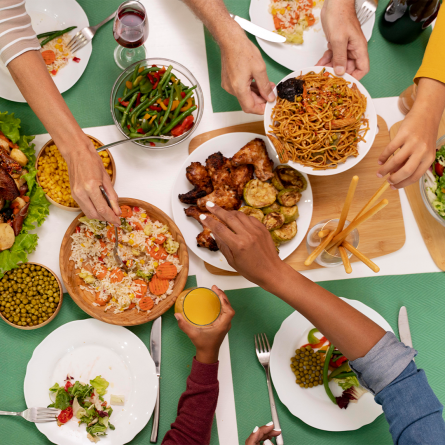
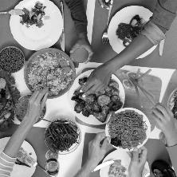

# Image processing

This project is intended to offer a set of basic features on image processing. It is a tool for image processing. 

> **Note**: At the moment, it supports JPEG, PNG, GIF and Webp

## Features 🌟

- [X] Flip X
- [X] Flip Y
- [X] Rotate 
  - [X] Left
  - [X] Right
  - [X] Transpose (invert columns and rows)
- [X] Grayscale
- [X] Crop
- [-] Resize
  - [X] Nearest neighbor (low quality)
  - [ ] Bilinear interpolation
  - [ ] Bicubic interpolation
- [X] Overlay
- [X] Blur
- [ ] Sharpen
- [X] Saturation
- [X] Brightness
- [X] Invert
- [X] Color temperature

## Dev requirements 🔎

It was developed on golang 1.20.4, but it is likely to work on golang 1.16+ for development. 

## Installing

For the build version you just need to install the [executable](https://github.com/DavidEsdrs/image-processing/releases
).

Make sure to have GCC or MinGW installed in your machine if you aim to support webp images.

❗ Are you encountering the "iproc: command not found" error or something similar? This happens because Windows isn't updating the PATH environment variables. You need add a PATH variable with the path that you downloaded the executable. Click [here](https://helpdeskgeek.com/windows-10/add-windows-path-environment-variable/) to learn how to update them manually.

## How to use :books:

After installing the build in your machine. You can perform one or more operations (listed below) onto the images. The arguments -i (input) and -o (output) are mandatory. You can perform one or more operations.

> **Note**: The file extension of the output determines the container of the file. It means that if your output is input.jpeg and you set the output as output.png, the container of the output will be PNG, and vice-versa.

```sh
iproc -i [input] -o [output] [...args]
```

Each argument perform a given effect:

- Flip Y:

```sh
iproc -i [input] -o [output] -fy
```

- Flip X:

```sh
iproc -i [input] -o [output] -fx
```

- Transpose (a rotation 270 degrees + flip in Y axis, it will be changed!!!)

```sh
iproc -i [input] -o [output] -t
```

- Resize (Nearest Neighbor):

For resizing, you have two options: you can either use a `scale factor` or specify the dimensions you want for the resizing.

```sh
iproc -i [input] -o [output] -nn -f [factor]
```

In the example above, the boolean flag nn indicates the use of the nearest neighbor algorithm (this will become clearer as more scaling algorithms are added). The f stands for a floating-point number, representing the scale factor for both width and height adjustments.
Alternatively, you can provide the dimensions directly:

```sh
iproc -i [input] -o [output] -nn -width [width] -height [height]
```

Width and height must be integers, representing pixel counts for each dimension.

**Note**: The factor of resize must be > 0. Note that the algorithm applied is the `nearest neighbor`, which is known to give pixelated results

Example:

```sh
# half of the actual size
iproc -i [input] -o [output] -nn .5
```

- Crop:

```sh
iproc -i [input] -o [output] -c [xstart],[xend],[ystart],[yend]
```

Example:
```sh
iproc -i [input] -o [output] -c 0,1000,0,200
```

The above can be simplified to:
```sh
iproc -i [input] -o [output] -c 1000,200
```
Representing xend and ysend.

**node**: Default values for xstart and ystart are both 0

- Grayscale:

```sh
iproc -i [input] -o [output] -gs
```

- Blur (Gaussian):

```sh
iproc -i [input] -o [output] -b 7 -s 3
```

**note**: the `b` flag indicates the size of the kernel that will be used for 
process the image. While the `s` flag indicates the `sigma` for the gaussian blur
kernel computation, it's optional.

- Overlay (put image onto another):

```sh
iproc -i [input] -o [output] -ov [overlay]
```

Overlay is the path to the overlay image. The input image will be the background.
You can pass any of the following flags (read the note):

- `dt`:
  - Distance from the top border of the overlay to the top border of the background
- `dl`:
  - Distance from the left border of the overlay to the left border of the background
- `dr`:
  - Distance from the right border of the overlay to the right border of the background
- `db`:
  - Distance from the bottom border of the overlay to the bottom border of the background

> **note**:: You can adjust the position of the overlay relative to background image, negative values are allowed. Use one or two of the flags below. Note that `dt` (distance top) takes precedence over `db` (distance bottom), which means that if you give distance top, the `db` will be ignored, the same applies to `dl` and `dr` (`dl takes precedence over `dr`).

> **note**: If you prefer using the development version, you just need to clone this repository and change `iproc` for `go run main.go`.

> **More will be added soon** 😄

## Tests

You can run the `test_suite.sh` script to run some commands and check the results.
They will be in the `output` folder with their respective effect as name.

## Examples ⭐

Apply grayscale filter, flip in Y axis and resize it to half its size

input:
```sh
iproc -i ./images/almoço.png -o ./assets/almoço.png -gs -fy -nn .5
```

before:



after:



## Known issues

- [X] FIXED - When applied, blur let image darker